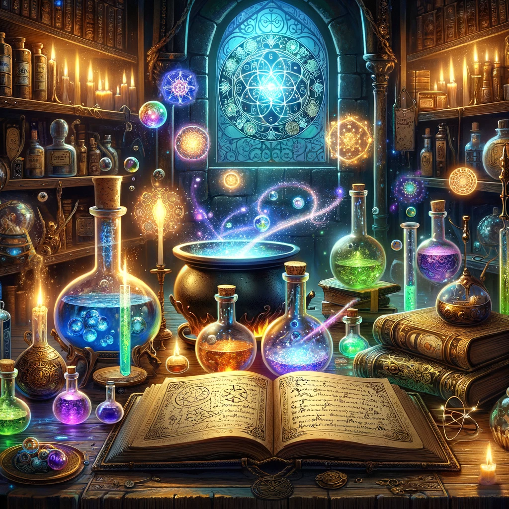

# Alchemy

***Alchemy*** (también conocido como ***Alquimia***), es un juego de lógica y rompecabezas. En este juego, los jugadores comienzan con elementos básicos como aire, agua, tierra y fuego, y los combinan para crear nuevos elementos. El objetivo es descubrir tantas combinaciones únicas como sea posible. Las combinaciones pueden ser intuitivas, como mezclar agua y tierra para hacer barro, o más abstractas y creativas.

El juego es conocido por su enfoque en la experimentación y el descubrimiento, incentivando a los jugadores a pensar de manera innovadora para desbloquear todos los elementos posibles. 

## Reto 

Desarrolle el juego, tomando como base la matriz propuesta debajo.

||||||||||||
|-|-|-|-|-|-|-|-|-|-|-|
|1|Aire
|2|Agua
|3|Tierra
|4|Fuego
|5|Vapor|=|Agua|+|Fuego|2+4
|6|Barro|=|Agua|+|Tierra|2+3
|7|Lava|=|Fuego|+|Tierra|4+3
|8|Polvo|=|Aire|+|Tierra|1+3
|9|Lluvia|=|Agua|+|Aire|2+1
|10|Planta|=|Barro|+|Lluvia|6+9
|11|Hierro|=|Fuego|+|Lava|4+7
|12|Arena|=|Aire|+|Lava|1+7
|13|Vidrio|=|Arena|+|Fuego|12+4
|14|Alcohol|=|Hierro|+|Vapor|11+5
|15|Vida|=|Barro|+|Energía|6+16
|16|Energía|=|Aire|+|Fuego|1+4
|17|Tormenta|=|Energía|+|Lluvia|16+9
|18|Metal|=|Barro|+|Fuego|6+4
|19|Electricidad|=|Energía|+|Metal|16+18
|20|Oxígeno|=|Agua|+|Electricidad|2+19
|21|Ozono|=|Electricidad|+|Aire|19+1
|22|Diamante|=|Carbono|+|Presión|23+24
|23|Carbono|=|Planta|+|Tierra|10+3
|24|Presión|=|Tierra|+|Tierra|3+3
|25|Madera|=|Planta|+|Metal|10+18
|26|Herramienta|=|Hierro|+|Madera|11+25
|27|Vaporizador|=|Herramienta|+|Vapor|26+5
|28|Computadora|=|Metal|+|Electricidad|18+19
|29|Robot|=|Computadora|+|Energía|28+16

## Propuesta de interfaz

```
Bienvenido al Juego de Alquimia!

Combina elementos para descubrir nuevos.

------------------------
MENU DEL JUEGO

1. Listar elementos
2. Proponer combinación
3. Salir

> SELECCIONE OPCION: 1
------------------------
Elementos conocidos:
1. Aire
2. Agua
3. Tierra
4. Fuego
------------------------
MENU DEL JUEGO

1. Listar elementos
2. Proponer combinación
3. Salir

> SELECCIONE OPCION: 2
------------------------
Selecciona dos elementos para combinarlos.
Ingresa el número del primer elemento: 1
Ingresa el número del segundo elemento: 2

Resultado: Has creado Lluvia!
------------------------
Elementos conocidos:
1. Aire
2. Agua
3. Tierra
4. Fuego
9. Lluvia
------------------------
MENU DEL JUEGO

1. Listar elementos
2. Proponer combinación
3. Salir

> SELECCIONE OPCION: 2
------------------------
Selecciona dos elementos para combinarlos.
Ingresa el número del primer elemento: 1
Ingresa el número del segundo elemento: 1

Resultado: La combinación propuesta no crea nada
------------------------
Elementos conocidos:
1. Aire
2. Agua
3. Tierra
4. Fuego
9. Lluvia
------------------------
MENU DEL JUEGO

1. Listar elementos
2. Proponer combinación
3. Salir


...
```
