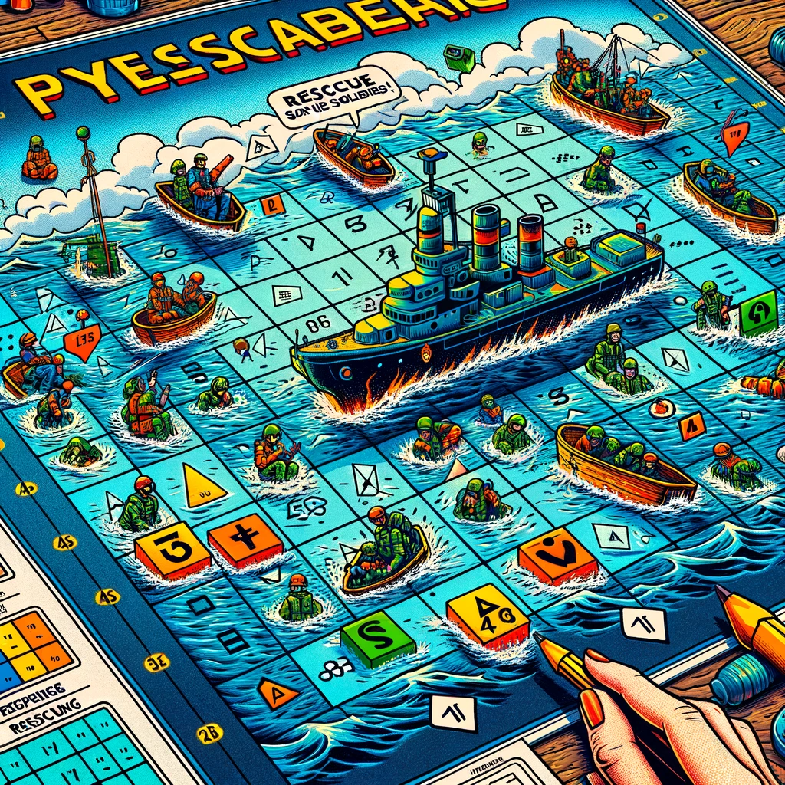

# pyRescateDeNaufragio

Lo que viene luego de la batalla naval...

---

**MAPA**

6 turnos / 2 rescatados

||A|B|C|D|E|F|G|H|
|-|-|-|-|-|-|-|-|-
|1|❔|❔|❔|❔|❔|❔|❔|❔
|2|❔|🌊|❔|❔|❔|❔|❔|❔
|3|❔|🌊|❔|❔|✅|❔|❔|❔
|4|❔|❔|❔|❔|❔|❔|❔|❔
|5|❔|❔|🌊|❔|❔|❔|❔|❔
|6|❔|❔|❔|❔|❔|✅|❔|❔
|7|❔|🌊|❔|❔|❔|❔|❔|❔
|8|❔|❔|❔|❔|❔|❔|❔|❔

**Zona de rescatados**

||A|B|C|D|E|F|G|H|
|-|-|-|-|-|-|-|-|-
||🤽‍♂️|🤽‍♂️|||||||
||||||||||


Turno 7 - Elija coordenada

---

## Reglas

### Inicio

- El juego inicia con el oponente colocando sus 16 soldaditos en casillas aleatorias (por ejemplo, H7).

### Nudo

- El jugador tiene 50 turnos para intentar salvar a los 16 soldaditos.
- Por cada turno
  - El jugador elige una coordenada.
  - Si esa coordenada tiene un soldadito náufrago, lo rescata y pasa a la zona de soldados rescatados.

### Final

- El jugador gana si logra rescatar a todos los soldaditos antes que pasen los 50 turnos.
- Si llegan los 50 turnos y no se han rescatado a todos:
  - Podría no haber rescatado ningún soldadito.
  - Podría haber rescatado algunos soldaditos.

## Retos extra

- A partir del turno 30, empieza a soplar un viento y cada 5 turnos los soldaditos podrían (todos) desplazarse una casilla aleatoriamente (sea derecha, izquierda, arriba o abajo).
- Tiene una oportunidad de lanzar una red. La red despeja (y rescata) las ocho celdas alrededor de la celda elegida. Por contra, consume 5 turnos, así que sea cuidadoso...

## Sugerencia de presentación

```
┏[manuel]--[main ≡ ● ]
┖[~/misRepos/pyRescateDeNaufragio/src]
   java Rescate.java
 +-a--b--c--d--e--f--g--h-
1| .  .  .  .  .  .  .  . 
2| .  .  .  .  .  .  .  . 
3| .  .  .  .  .  .  .  . 
4| .  .  .  .  .  .  .  . 
5| .  .  .  .  .  .  .  . 
6| .  .  .  .  .  .  .  . 
7| .  .  .  .  .  .  .  . 
8| .  .  .  .  .  .  .  . 
 +------------------------

Estas en el turno 1
Has rescatado 0
Ingrese coordenada: a1

 +-a--b--c--d--e--f--g--h-
1| ~  .  .  .  .  .  .  . 
2| .  .  .  .  .  .  .  . 
3| .  .  .  .  .  .  .  . 
4| .  .  .  .  .  .  .  . 
5| .  .  .  .  .  .  .  . 
6| .  .  .  .  .  .  .  . 
7| .  .  .  .  .  .  .  . 
8| .  .  .  .  .  .  .  . 
 +------------------------

 << MAS ADELANTE... >>

 +-a--b--c--d--e--f--g--h-
1| ~  ~  ~  ~  ~  ~  .  . 
2| ~ \O/\O/ ~  ~  ~  .  . 
3| ~  ~  ~ \O/ ~  ~  .  . 
4| ~ \O/\O/\O/ ~ \O/ .  . 
5| ~ \O/ ~  ~ \O/ ~  .  . 
6| ~  ~  ~  ~ \O/\O/ .  . 
7| ~  ~  ~  ~ \O/ ~  .  . 
8| ~ \O/ ~  ~ \O/ ~  .  . 
Estas en el turno 49
Has rescatado 14
Ingrese coordenada: g1

 +-a--b--c--d--e--f--g--h-
1| ~  ~  ~  ~  ~  ~  ~  . 
2| ~ \O/\O/ ~  ~  ~  .  . 
3| ~  ~  ~ \O/ ~  ~  .  . 
4| ~ \O/\O/\O/ ~ \O/ .  . 
5| ~ \O/ ~  ~ \O/ ~  .  . 
6| ~  ~  ~  ~ \O/\O/ .  . 
7| ~  ~  ~  ~ \O/ ~  .  . 
8| ~ \O/ ~  ~ \O/ ~  .  . 
 +------------------------
Estas en el turno 50
Has rescatado 14
El juego ha terminado

```
